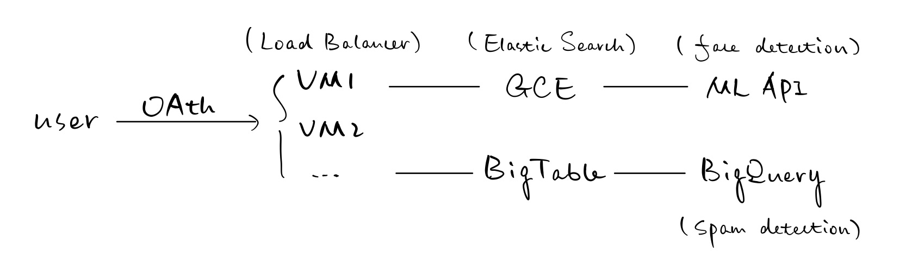

# Radius

Radius is a social media based on Geo-Location, it is built with ReactJS and Golang on Google Cloud Platform. Users can search nearby posts within a certian distance. Other features include face detection (Google Cloud Machine Learning Engine) and key-word based spam detection (BigQuery).

## Project Components
